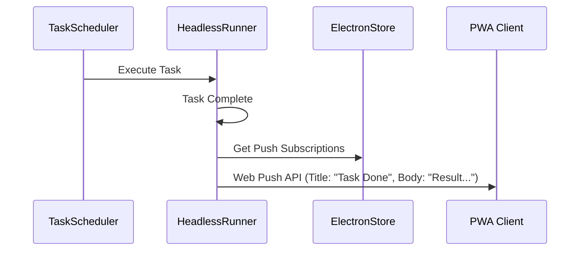

# Clawdia PWA Implementation Plan

## 1. Current Architecture Inventory

The following inventory maps existing IPC channels to their logical PWA counterparts.

### Chat / LLM Channels
| Channel | Type | Method | Description | Data Flow |
| :--- | :--- | :--- | :--- | :--- |
| `chat:send` | Invoke | POST | Send a new message to the LLM | `UserMessage` → `void` (triggers stream) |
| `chat:stop` | Invoke | POST | Stop the current generation | `void` → `void` |
| `chat:new` | Invoke | POST | Create a new conversation | `void` → `ConversationId` |
| `chat:list` | Invoke | GET | List all conversations | `void` → `Conversation[]` |
| `chat:load` | Invoke | GET | Load specific conversation history | `convId` → `Message[]` |
| `chat:delete` | Invoke | DELETE | Delete a conversation | `convId` → `boolean` |
| `chat:get-title` | Invoke | GET | Get conversation title | `convId` → `string` |
| `chat:stream-chunk` | Event | WS | Streaming text delta | Main → Renderer (`string`) |
| `chat:tool-start` | Event | WS | Tool execution started | Main → Renderer (`ToolExecStartEvent`) |
| `chat:tool-end` | Event | WS | Tool execution finished | Main → Renderer (`ToolExecCompleteEvent`) |

### Task Channels
| Channel | Type | Method | Description | Data Flow |
| :--- | :--- | :--- | :--- | :--- |
| `task:list` | Invoke | GET | List all persistent tasks | `void` → `PersistentTask[]` |
| `task:create` | Invoke | POST | Create a new task | `CreateTaskParams` → `PersistentTask` |
| `task:update` | Invoke | PUT | Update a task | `UpdateTaskParams` → `PersistentTask` |
| `task:run` | Invoke | POST | Manually trigger a task run | `taskId` → `void` |
| `task:broadcast-state`| Event | WS | Real-time task status updates | Main → Renderer (`TaskDashboardItem[]`) |

### Dashboard Channels
| Channel | Type | Method | Description | Data Flow |
| :--- | :--- | :--- | :--- | :--- |
| `dashboard:get-state` | Invoke | GET | Get immediate full state | `void` → `DashboardState` |
| `dashboard:update` | Event | WS | Push periodic state updates | Main → Renderer (`DashboardState`) |

### Browser Channels (Desktop Only)
*Note: Most browser channels are not applicable to PWA as the PWA cannot render the `BrowserView` directly. However, the PWA can trigger navigations that happen on the host machine.*
| Channel | Type | Method | Description | Data Flow |
| :--- | :--- | :--- | :--- | :--- |
| `browser:navigate` | Invoke | POST | Navigate host browser | `url` → `void` |
| `browser:tabs:get` | Invoke | GET | Get open tabs | `void` → `BrowserTabInfo[]` |

### Vault Channels
| Channel | Type | Method | Description | Data Flow |
| :--- | :--- | :--- | :--- | :--- |
| `vault:search` | Invoke | GET | Search knowledge base | `query` → `VaultSearchResult[]` |

---

## 2. Streaming Architecture Analysis

The current streaming architecture in `src/main/llm/tool-loop.ts` functions as follows:

1.  **Trigger**: `chat:send` initiates `ToolLoop.run()`.
2.  **Emission**: The `ToolLoop` accepts an `emitter` object (implementing `ToolLoopEmitter`).
3.  **Events**:
    *   `content`: Emitted whenever the LLM yields a text chunk.
    *   `tool_start`: Emitted when the LLM decides to use a tool. Includes `toolName` and `input`.
    *   `tool_end`: Emitted when a tool finishes. Includes `result`.
    *   `loop_complete`: Emitted when the entire turn is finished.
4.  **Transport**: In `main.ts`, these internal events are forwarded to `mainWindow.webContents.send()`.

**PWA Adaptation**:
The PWA cannot use standard HTTP request/response for this because the response is a long-lived stream of heterogeneous events (text deltas + structured tool events).
*   **Solution**: Bridge `ToolLoopEmitter` to a WebSocket connection. When a PWA client sends a message via WS or POST, subscribe that specific WS connection to the `ToolLoop` events for the duration of the generation.

---

## 3. Authentication & State Analysis

*   **API Keys**: Stored in `electron-store`. The implementation is local-first.
*   **Session State**: Currently tied to the `BrowserWindow`.
*   **Multi-tenancy**: The app is designed as single-user. The PWA should authenticate as "the owner".
*   **Auth Strategy**:
    *   Generate a high-entropy "Connection Token" on the desktop app (e.g., in Settings).
    *   The user scans a QR code or enters this token into the PWA.
    *   The token is stored in `localStorage` on the mobile device.
    *   All HTTP requests send `Authorization: Bearer <TOKEN>`.
    *   WebSocket connection handshake requires the token.

---

## 4. PWA Implementation Plan

### Phase 1: Express Server + REST API

**Location**: `src/main/server/index.ts` (New module)

**Startup**: 
Initialize inside `src/main/main.ts` after `app.whenReady()`.

**Port Selection**:
Default to `3000`. If occupied, increment until free. Log the final URL to the dashboard/console.

**Endpoints**:
*   `POST /api/chat` - Start conversation / send message.
*   `GET /api/chat/:id/history` - Load history.
*   `GET /api/dashboard` - Get current dashboard state.
*   `POST /api/tasks` - Create task.
*   `GET /api/tasks` - List tasks.
*   `GET /manifest.json` - Serve PWA manifest.
*   `GET /` - Serve the PWA static files.

**Middleware**:
*   `authMiddleware`: Verifies the Bearer token against the stored local token.
*   `corsMiddleware`: Allow generic LAN access (e.g., `*` or strictly local IPs).

### Phase 2: WebSocket Layer

**Library**: `ws` (attached to the Express HTTP server).

**Event Mapping**:
Every time the desktop app emits an IPC event (e.g., `dashboard:update`), we must also broadcast it to all authenticated WebSocket clients.

**Chat Bridge**:
When a request comes in via WS to `chat:send`:
1.  Resolve the LLM Client.
2.  Create a `SocketEmitter` that wraps the WS connection.
3.  Pass this emitter to `ToolLoop.run()`.
4.  As the tool loop runs on the desktop, the phone receives real-time updates.

### Phase 3: PWA Frontend

**Structure**: `src/pwa/`
*   Reusing `src/renderer` code is risky due to Node.js/Electron dependencies.
*   **Recommendation**: A separate, lightweight React/Vite project in `src/pwa`.
*   Build output goes to `dist/pwa`, which Express serves.

**Views**:
1.  **Chat**: Replicates the chat UI.
    *   *Differences*: "Browser Actions" (like screenshots) will be displayed as static images sent from the server. The PWA user *cannot* interact with the live browser view, only see the results.
2.  **Dashboard**: Read-only view of the desktop dashboard metrics and activity feed.
3.  **Tasks**: Full CRUD for tasks.
4.  **Settings**: QR Code scanner (optional) or input field for the Connection Token.

**Manifest.json**:
*   `name`: "Clawdia Mobile"
*   `display`: "standalone"
*   `theme_color`: "#DARK_MODE_COLOR"
*   `icons`: Standard set.

### Phase 4: Push Notifications

**Technology**: Web Push Protocol (VAPID).

**Flow**:
1.  **Dependencies**: `web-push` npm package on Main.
2.  **Subscription**: PWA requests permission -> gets `PushSubscription` -> sends to Desktop via REST.
3.  **Storage**: Desktop stores subscriptions in `electron-store` key `pwa_push_subs`.
4.  **Trigger**: Inside `src/main/tasks/scheduler.ts`, wherever a desktop notification is triggered, also iterate through stored subscriptions and send a payload.

**Events**:
*   Task Completion (Success/Fail)
*   Haiku/System Alerts (High priority only)

**iOS Note**: Web Push on iOS requires the app to be "Added to Home Screen".

---

## 5. Data Flow Diagrams

### A) Chat Message from Phone
```mermaid
sequenceDiagram
    participant Phone as PWA (Phone)
    participant WS as WebSocket/Express
    participant Loop as ToolLoop (Desktop)
    participant llm as LLM API

    Phone->>WS: SEND { text: "Check my email" }
    WS->>Loop: Run(conversationId, input)
    Loop->>llm: Generate
    llm-->>Loop: Stream Delta "I will..."
    Loop-->>WS: EVENT "content" { delta: "I will..." }
    WS-->>Phone: Render Text
    Loop->>Loop: Execute Tool (Browser)
    Loop-->>WS: EVENT "tool_start" { name: "browser_navigate" }
    WS-->>Phone: Show "Navigating..." Spinner
    Loop-->>WS: EVENT "tool_end" { result: "Gmail Loaded" }
    WS-->>Phone: Show Tool Result
```

### B) Background Task Notification


---

## 6. Desktop vs. Mobile Differences

| Feature | Desktop App | Mobile PWA | Notes |
| :--- | :--- | :--- | :--- |
| **Logic Core** | Runs locally (Node.js) | Remote Control | PWA is a remote for the Desktop brain. |
| **Browser View** | Live Interactive `BrowserView` | Snapshots Only | Mobile cannot see live video of the browser; receives screenshots/text only. |
| **System Access** | Full (Filesystem, Shell) | None (Directly) | Mobile requests Desktop to perform FS ops. |
| **Connectivity** | Localhost | LAN / Tailscale | Requires network path to Desktop. |
| **Push Notifs** | Native System Notifs | Web Push API | Requires Service Worker. |
| **State** | In-Memory / Disk | Synced via WS | PWA state is ephemeral cache of Desktop state. |

---

## 7. Security Considerations

1.  **LAN Exposure**: The Express server opens a port on the local network.
    *   *Mitigation*: Bind to `0.0.0.0` is necessary for phone access, but strictly enforce Bearer Token auth for *every* endpoint.
2.  **No TLS**: Running HTTPS on a local IP avoids "Not Secure" warnings but requires self-signed cert management which is painful for PWAs (Service Workers often reject self-signed certs).
    *   *Mitigation*: Suggest using **Tailscale** or a similar mesh VPN. This allows hitting the machine via a stable IP/name and potentially handling encryption securely. Alternatively, serve over HTTP but warn the user. **Critical**: Service Workers (required for PWA) *only* work on `localhost` or `https`. They do **not** work on `http://192.x.x.x`.
    *   *Solution*: The user *must* set up a reverse proxy with a valid cert OR use a tunneling service (like ngrok/Cloudflare Tunnel) OR accept that the PWA features (offline/install/push) won't work on plain LAN IP unless configured as a development exception.
    *   *Recommended "Pro" Path*: Use a Tunnel (Cloudflare/Tailscale Funnel) to give the desktop a secure HTTPS public URL.
3.  **Shell Execution**: The `run_command` tool is powerful.
    *   *Mitigation*: The PWA is authenticated as the *owner*. If the token is compromised, the attacker has full control. This is acceptable for a single-user tool, provided the token is strong.

## 8. Dependencies Required

*   `express`: Robust, standard server for the API.
*   `ws`: Efficient WebSocket implementation for Node.js.
*   `web-push`: For generating VAPID keys and sending notifications.
*   `cors`: To handle Cross-Origin requests from the mobile browser.
*   `body-parser`: Standard JSON handling.
*   `ip`: To easily detect and display the machine's LAN IP to the user.

## 9. Risk Assessment

1.  **Service Worker HTTPS Requirement**: This is the biggest technical hurdle. Standard PWAs **require** a secure context (HTTPS) to register a Service Worker. A simple Express server on HTTP will not allow the phone to "Install App" or receive Push Notifications.
    *   *Mitigation*: The plan must include a strategy for HTTPS. Self-signed certs are often rejected by mobile OSs. The most robust zero-config solution for users is a Tunnel (e.g., `cloudflared` or `ngrok`).
2.  **Desktop Sleep**: When the desktop sleeps, the server dies.
    *   *Mitigation*: The PWA needs a clear "Disconnected" state and auto-reconnection logic.
3.  **Concurrent State**: If the user chats on Desktop while looking at Mobile, state needs to sync.
    *   *Mitigation*: The WebSocket broadcast system handles this naturally. State is "server-authoritative".
